# PontLook SaaS System Architecture

## 1. Framework & Stack Summary

- **Core Framework**: Next.js (v14.2.15) utilizing the **App Router** (`src/app`).
- **Language**: TypeScript (`.tsx` / `.ts`).
- **Styling**: Tailwind CSS (v3.4.13) paired with PostCSS and Autoprefixer.
- **UI & Animations**: `lucide-react` for icons and `framer-motion` for complex animations.
- **State Management & Forms**: 
  - Standard React hooks for local state.
  - `react-hook-form` paired with `zod` for robust client-side form validation (especially in the multi-step wizard).
- **Content Management**: Markdown/MDX parsing using `next-mdx-remote` and `gray-matter`.
- **Internationalization (i18n)**: Implemented natively via dynamic route segments (`[lang]`) and custom dictionaries.

*Note: No dedicated database ORM is present in the provided `package.json`. Data fetching is either done via direct API calls inside the `src/app/api` directory, or by statically reading local Markdown/MDX files.*

## 2. Directory Tree

```text
src/
├── app/                  # Next.js App Router Root
│   ├── (root)/           # General layout grouping without adding a URL segment
│   ├── [lang]/           # Dynamic segment for Internationalization (e.g., /en, /ar)
│   │   ├── contact/      # Contact Us page route
│   │   ├── find-training/# Multi-step wizard page route for finding training
│   │   ├── for-providers/# Information page route for training providers
│   │   └── research/     # Insights and research blog routes
│   ├── api/              # Backend API routes
│   └── globals.css       # Global stylesheet (Tailwind directives)
├── components/           # Reusable React UI Components
│   ├── contact/          # Forms and UI specific to the Contact page
│   ├── home/             # Sections for the landing page (Hero, StatsCounter, etc.)
│   ├── layout/           # Global layout structural components (Navbar, Footer)
│   ├── providers/        # Context providers (e.g., DictionaryProvider)
│   ├── shared/           # Generic reusable UI elements (Reveal, SectionHeading, etc.)
│   └── wizard/           # The complex multi-step "Find Training" form components
├── i18n/                 # Translation dictionaries and i18n configuration
└── lib/                  # Shared utility functions (e.g., parsing Markdown posts)
```

## 3. Component Graph

```mermaid
flowchart TD
    %% Layouts & Routing
    RootLayout["Root Layout 'app/layout.tsx'"]
    LangLayout["Lang Layout 'app/[lang]/layout.tsx'"]
    
    %% Pages
    HomePage[Home Page]
    FindTrainingPage[Find Training Page]
    ResearchPage[Research Page]
    
    %% Layout Components
    Navbar[Navbar]
    Footer[Footer]
    
    %% Home Sub-Components
    Hero["src/components/home/Hero.tsx"]
    TrustBar["src/components/home/TrustBar.tsx"]
    StatsCounter["src/components/home/StatsCounter.tsx"]
    WhyDifferent["src/components/home/WhyDifferent.tsx"]
    HowItWorks["src/components/home/HowItWorks.tsx"]
    ProviderTeaser["src/components/home/ProviderTeaser.tsx"]
    FindTrainingTeaser["src/components/home/FindTrainingTeaser.tsx"]
    InsightsPreview["src/components/home/InsightsPreview.tsx"]
    FinalCta["src/components/home/FinalCta.tsx"]
    
    %% Shared Components
    Reveal["src/components/shared/Reveal.tsx"]
    
    %% Flow
    RootLayout --> LangLayout
    LangLayout --> Navbar
    LangLayout --> HomePage
    LangLayout --> FindTrainingPage
    LangLayout --> ResearchPage
    LangLayout --> Footer
    
    %% Home Page Structure
    HomePage --> Hero
    HomePage --> TrustBar
    HomePage --> StatsCounter
    HomePage --> WhyDifferent
    HomePage --> HowItWorks
    HomePage --> ProviderTeaser
    HomePage --> FindTrainingTeaser
    HomePage --> InsightsPreview
    HomePage --> FinalCta
    
    %% Component Dependencies
    Hero -. uses .-> Reveal
    WhyDifferent -. uses .-> Reveal
    HowItWorks -. uses .-> Reveal
    ProviderTeaser -. uses .-> Reveal
    FindTrainingTeaser -. uses .-> Reveal
    InsightsPreview -. uses .-> Reveal
    FinalCta -. uses .-> Reveal
```



## 4. Data Flow

1. **Initial Request & Routing**: A user navigates to a URL (e.g., `/en/find-training`). The Next.js router captures the language param `[lang]`.
2. **Server-Side Data Gathering**: 
   - **Translations**: The `DictionaryProvider` or server layout loads the corresponding JSON translation file from `src/i18n/dictionaries`.
   - **Content**: If navigating to the `/research` route, Server Components utilize `lib/posts.ts` to parse local markdown files via `gray-matter` and `next-mdx-remote`.
3. **Server-to-Client Hydration**: Server Components stream the HTML structure down. Interactivity is hydrated onto Client Components (marked by `"use client"`). This includes complex components like the `FindTrainingWizard`, `Navbar`, and `FramerMotionProvider`.
4. **Client-Side Interactions**:
   - The user interacts with the `FindTrainingWizard`. `react-hook-form` tracks the state locally, and `zod` validates the input at each step.
   - Animations trigger on scroll using `framer-motion` (e.g., `Reveal` component).
5. **Form Submission**: Upon finalizing a form (Contact, Partnership, or Wizard), the Client Component serializes the payload and sends it via `fetch` to the respective Next.js Route Handler in `src/app/api/`.
